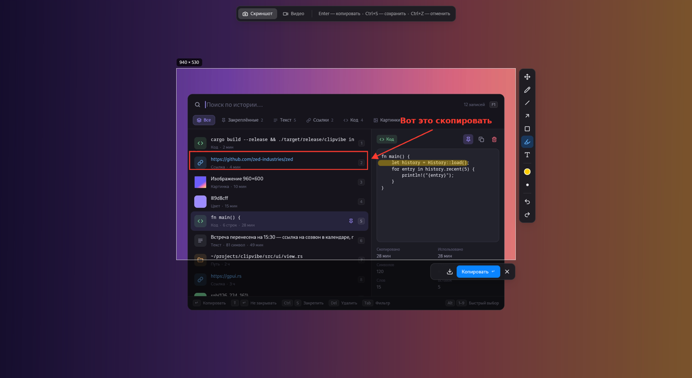
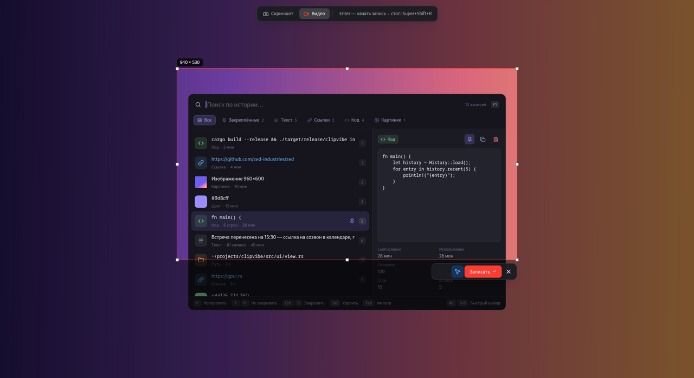

# shotvibe

Скриншоты и запись экрана в стиле [Lightshot](https://app.prntscr.com/) для
Linux на [GPUI](https://gpui.rs) (UI-фреймворк Zed). Сделано под GNOME на Wayland.



| Хоткей | Что делает |
|---|---|
| **Print** | скриншот области с редактором |
| **Super+Shift+R** | запись области экрана в видео; повторное нажатие — стоп |

Встроенный скриншотер GNOME при установке переезжает на **Super+Print**.

## Установка

```sh
cargo build --release
./target/release/shotvibe install
```

`install` копирует бинарник в `~/.local/bin`, добавляет ярлык в меню приложений
и хоткеи GNOME.

## Скриншоты

Экран «замораживается», дальше выделяете область мышью (Shift — квадрат).
Рамку можно двигать и тянуть за ручки, над ней показан размер в пикселях.
Рядом с выделением появляются две панели:

- **инструменты**: перемещение `V`, карандаш `P`, линия `L`, стрелка `A`,
  прямоугольник `R`, маркер `H`, текст `T`, цвет (`C` — следующий), толщина
  (`[` `]` или колесо мыши), отмена / повтор (`Ctrl Z` / `Ctrl Shift Z`).
  Shift при рисовании — линии под 45°, ровный квадрат;
- **действия**: `Enter` / `Ctrl C` — скопировать картинку и закрыть,
  `Ctrl S` — сохранить в `~/Pictures/Screenshots` (и тоже скопировать), `Esc` — выйти.

`Ctrl A` — весь экран, стрелки двигают рамку (Shift — по 10 px, Alt — меняют размер).

## Видео



`Tab` переключает режим **Скриншот ↔ Видео** (или сразу `shotvibe --video`).
`Enter` начинает запись выбранной области, курсор на записи можно отключить
кнопкой. Остановить — тем же хоткеем или кнопкой «Остановить» в уведомлении.
Ролик (mp4, H.264) сохраняется в `~/Videos/Screencasts` и кладётся в буфер
как файл — его можно сразу вставить в Telegram или файловый менеджер.

## Как устроено

- **Скриншот** снимается через xdg-desktop-portal (`Screenshot`, на GNOME без
  диалога), **видео** пишет сам GNOME Shell (`org.gnome.Shell.Screencast` по
  D-Bus): ffmpeg и pipewire не нужны. Запись привязана к D-Bus-соединению
  процесса `shotvibe record-area`.
- Аннотации на итоговой картинке рисуются на CPU (tiny-skia + ab_glyph), поэтому
  совпадают с тем, что видно на экране.
- Окно закрывается сразу после копирования, а буфер держит маленький фоновый
  процесс `shotvibe hold-image` (через XWayland, GNOME передаёт содержимое
  Wayland-приложениям). Он завершается, как только скопировано что-то другое.
- Хорошо сочетается с [clipvibe](https://github.com/monforje/clipvibe):
  скриншоты и записи сами попадают в его историю буфера.

## Сборка

Нужны Rust (edition 2024) и системные библиотеки для gpui. Для Debian/Ubuntu:

```sh
sudo apt install libxkbcommon-dev libxkbcommon-x11-dev libwayland-dev libxcb1-dev \
    libfontconfig-dev libfreetype-dev libvulkan1 mesa-vulkan-drivers fonts-dejavu-core
```

`vendor/xattr` — пропатченный `xattr 0.2.3` (тянется через gpui → zed-async-tar):
в свежем `libc` нет `ENOATTR`, подключён через `[patch.crates-io]`.

Ограничения: один монитор, запись видео только в GNOME, текст аннотаций в одну строку.

Протестировано на Debian 13, GNOME 48 (Wayland).
